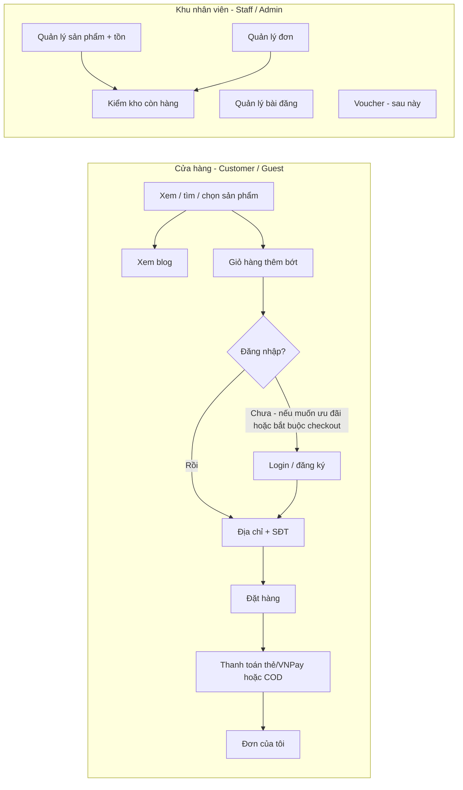

# Tài liệu 11 — Vai trò, luồng vận hành và độ phủ chức năng

| Thông tin | Chi tiết |
|-----------|----------|
| **Tên tài liệu** | Review vai trò + luồng hệ thống theo 3 nhóm người dùng |
| **Phiên bản** | 1.0.0 |
| **Ngày** | 2026-08-18 |
| **Nguồn** | Yêu cầu vận hành (Customer / Staff / Admin) đối chiếu `docs/02`, `docs/05`, `docs/09` và codebase `apps/web` + `apps/api` |

> Đây là tài liệu **đối chiếu thực tế**: chức năng bạn cần vs hệ thống đã có. Spec RBAC chi tiết vẫn nằm ở `docs/02`. Backlog kỹ thuật (bug tiền tệ, kho) vẫn nằm ở `docs/09`.
>
> **Manager** được ghi nhận để sau — **không tạo role/màn hình Manager trong bản này.**

---

## 1. Kết luận ngắn

Hệ thống **đã tách 2 cổng đăng nhập và 2 khu giao diện** (cửa hàng vs khu nhân viên). Luồng **khách xem → tìm → chọn → giỏ → đặt hàng** đã có hình hài. Luồng **staff/admin quản lý kho, bài đăng, voucher, kiểm tồn** **chưa đủ** và **chưa chia menu theo role**.

| Nhóm bạn mô tả | Đủ để dùng hàng ngày? | Ghi chú |
|----------------|----------------------|---------|
| **Customer** (cửa hàng) | **Một phần (~70%)** | Xem/tìm/chọn SP, blog, giỏ, đặt hàng, COD/Stripe có. Login bắt buộc lúc checkout. Địa chỉ/SĐT còn mỏng. Header chưa ô tìm. Voucher khách dùng được một phần, **chưa có ưu đãi chỉ vì đã login**. |
| **Staff** (kho, bài, kiểm tồn) | **Chưa (~20%)** | Cùng màn `/admin` với admin. Nhân viên kho (`WAREHOUSE`) **bị API chặn** hầu hết thao tác. Không có màn kho, không có quản lý blog/voucher trên UI. |
| **Admin** (quản lý đầy đủ) | **Một phần (~45%)** | Có list đơn, khách, tạo/sửa sản phẩm, bật/tắt SP. Blog/media/voucher UI còn stub hoặc chưa có. Menu không ẩn mục ngoài quyền. |
| **Manager** | **Chưa làm (cố ý)** | Gần nhất với role `ADMIN` hiện tại. Thêm sau khi staff/admin đã tách quyền trên UI. |

**Kết luận luồng:** hướng đi bạn mô tả **đúng với kiến trúc sẵn có** (2 portal). Hệ thống **chưa đầy đủ** các chức năng quản lý bạn liệt kê; phần bán hàng khách **đi được demo**, chưa phải vận hành shop VN hoàn chỉnh.

---

## 2. Hai màn hình (đã có, giữ nguyên hướng)

```
Khách / Guest                         Nhân viên / Admin
────────────────                      ────────────────
Cửa hàng (storefront)                 Khu hệ thống (/admin)
  /vi  /en                              /vi/admin/...
Đăng nhập khách                       Đăng nhập nhân viên
  /vi/dang-nhap                         /vi/dang-nhap-nhan-vien
  /en/auth/login                        /en/auth/staff-login
```

- Khách **không** vào `/admin` (middleware đẩy về login khách hoặc staff tùy route).
- Staff/admin **không** dùng form login khách (`portal: staff` từ chối role `CUSTOMER`).
- **Chưa** có màn riêng “staff kho” vs “admin”: cùng `AdminShell`, cùng menu.

---

## 3. Ánh xạ cách gọi vận hành ↔ role trong hệ thống

Bạn đang dùng **3 user**. Trong database **không có** role tên `staff` hay `manager`. “Staff” là **nhóm portal**, gồm vài role kỹ thuật.

| Bạn gọi | Role trong DB | Tài khoản seed (tham khảo) | Portal | Việc đúng vai |
|---------|---------------|----------------------------|--------|----------------|
| **Customer** | `CUSTOMER` (+ `GUEST` khi chưa login) | `customer@myshop.dev` | Cửa hàng | Xem/mua, giỏ, đơn của mình, địa chỉ |
| **Staff** | `WAREHOUSE`, `SUPPORT`, `CONTENT` | `warehouse@myshop.dev`, `support@myshop.dev` | `/admin` | Kho, đơn vật lý, CSKH, bài viết — **tùy role** |
| **Admin** | `ADMIN`, `SUPER_ADMIN` | `admin@myshop.dev` | `/admin` | Sản phẩm, đơn, khách, cấu hình, (sau này) voucher |
| **Manager** *(sau này)* | Chưa có | — | `/admin` (dự kiến) | Giám sát vận hành, không cần quyền hệ thống của Super Admin. **Gần ADMIN hiện tại.** Không implement lúc này. |

Role kỹ thuật khác (giữ trong spec, không đổi tên):

- `SUPER_ADMIN` — chủ hệ thống (cấu hình, xóa cứng, gán admin).
- `CONTENT` — blog/CMS (API blog đã mở cho CONTENT; **UI admin blog còn stub**).
- `SUPPORT` — CSKH / xem khách + đơn (một phần API users).

Không gộp Customer vào cùng login staff. Không cho staff mua hàng bằng tài khoản nội bộ (đặt hàng API dành cho khách đã login).

---

## 4. Luồng mục tiêu (theo mô tả của bạn)



Voucher: **khách nhận ưu đãi sau login** và **staff/admin tạo voucher** là hai mặt của cùng module coupon — làm sau, schema/API coupon đã có nền.

---

## 5. Customer — checklist chức năng

| Chức năng bạn cần | Guest | Customer đã login | UI | API | Đủ? |
|-------------------|:-----:|:-----------------:|:--:|:---:|:---:|
| Xem sản phẩm | Có | Có | List, PDP, home | `GET /products` | **Có** |
| Tìm sản phẩm | Có trên trang `/san-pham` **và header** | Có | Filter bar + ô tìm header | `search` query | **Có** |
| Chọn sản phẩm (PDP, variant, thêm giỏ) | Có | Có | PDP + giỏ | `POST /cart` / localStorage | **Có** |
| Xem bài đăng | Có | Có | `/blog`, `/blog/[slug]` | `GET /blog` | **Có** — chưa lọc chuyên sâu |
| Xem giỏ hàng | Có (local) | Có (server) | `/gio-hang`, CartDrawer | `GET /cart` | **Có** |
| Thêm / bớt / xóa dòng giỏ | Có | Có | Cart | add/update/delete | **Có** — merge guest→login còn race |
| Đặt hàng | **Không** (bắt login) | Có | Checkout 4 bước | `POST /orders` | **Có** — locale `vi` đổi USD→VND lúc tạo đơn |
| Đăng nhập (ưu đãi) | — | Login/register | 2 form tách staff | `POST /auth/login` | **Có login** — **chưa** ưu đãi riêng vì đã login |
| Thêm địa chỉ | — | Checkout có tạo mới | Account thêm/sửa/mặc định/xóa | `POST/PUT /users/me/addresses` | **Có** |
| Số điện thoại | — | Profile + checkout | Account sửa SĐT | `PUT /users/me` | **Có** |
| Thanh toán trực tiếp | — | Stripe, VNPay | Checkout | payments | Stripe demo được; VNPay kết quả đọc `ok=0\|1` |
| Ship COD | — | Locale `vi` | Checkout | `POST /payments/cod` | **Có** (chỉ đơn VN) |
| Voucher giảm giá *(sau này)* | — | Ô mã lúc checkout | Nhập code, **không preview** | Apply lúc tạo đơn; CRUD admin **không UI** | **Nền API có, UX chưa** |
| Wishlist | Có UI (cần login) | Có | `/yeu-thich` | wishlist | Có, ngoài list tối thiểu của bạn |
| Đơn của tôi / hủy pending | — | Có | `/don-hang` + chi tiết | orders | **Có** — đổi/trả sau giao (7 ngày) |

**Luồng khách đã chạy được (happy path demo):**

1. Vào cửa hàng → danh sách / danh mục / PDP  
2. Thêm giỏ (guest hoặc đã login)  
3. Vào thanh toán → hệ thống đòi đăng nhập nếu chưa  
4. Điền địa chỉ + SĐT (hoặc chọn địa chỉ đã lưu)  
5. Chọn Stripe / VNPay / COD  
6. Xem đơn  

**Còn lệch so với mô tả tối thiểu:**

- “Đăng nhập để nhận ưu đãi” chưa có rule (giá/coupon member). Checkout **bắt** login, không phải tùy chọn.  
- Voucher: khách gõ code được; không có trang “voucher của tôi”; admin chưa có màn tạo voucher.

---

## 6. Staff và Admin — checklist chức năng

Cùng URL `/admin/*`. **Staff và Admin chưa có màn hình nghiệp vụ tách menu.**

| Chức năng bạn cần | Role đúng (spec) | UI hiện tại | API hiện tại | Đủ? |
|-------------------|------------------|-------------|--------------|:---:|
| Quản lý sản phẩm đăng bán | ADMIN | List + **tạo/sửa form** + bật/tắt | CRUD products `requireAdmin` | Admin: **một phần**; Staff kho: **không** |
| Kiểm tra kho còn hàng | WAREHOUSE, ADMIN | Cột tồn trên list sản phẩm | `stockQuantity` trên product; **không** module inventory | **Một phần (xem số)** |
| Quản lý kho (nhập / điều chỉnh / sổ kho) | WAREHOUSE | **Không có** `/admin/inventory` | **Không** `PATCH /inventory`; sửa tồn trên form SP **không** ghi `inventory_transaction` | **Chưa** |
| Xử lý đơn (đóng gói, giao) | WAREHOUSE, ADMIN | List đơn + đổi status | `GET/PATCH orders/admin` **chỉ ADMIN** | Admin: **một phần**; Staff: **403** |
| Quản lý bài đăng | CONTENT, ADMIN | Admin blog **chỉ tiêu đề** | Blog API có, role CONTENT | **Chưa (UI)** |
| Quản lý voucher *(sau này)* | ADMIN | **Không trang** | Module `/coupons` đã mount | **API có, UI chưa** |
| Quản lý khách | SUPPORT, ADMIN | List + lọc | `GET /admin/users` | **Một phần** — chưa khóa tài khoản |
| Media / CMS trang tĩnh | CONTENT, ADMIN | Media stub | Media upload ADMIN-only | **Chưa** |
| Cài đặt (tỷ giá) | ADMIN | Có | settings | Admin: có |
| Menu theo role | — | Mọi staff thấy đủ menu | Nhiều API 403 với WAREHOUSE | **Chưa** — UX sai quyền |

**Luồng staff/admin bạn tính vs thực tế:**

| Bước mong muốn | Thực tế |
|----------------|---------|
| Staff vào kho, xem còn hàng, nhập/xuất | Đăng nhập staff được → vào `/admin` thấy menu admin → **kho không có**; list sản phẩm API **403** nếu là WAREHOUSE |
| Staff/admin sửa bài đăng | Trang blog admin trống |
| Admin tạo voucher khi muốn khuyến mãi | Chỉ gọi API; không màn hình |
| Admin quản lý SP đăng tải | **Đã có** list + form tạo/sửa + ảnh + variant + thông số |

---

## 7. Đã đầy đủ chưa? (theo từng luồng)

### Luồng A — Khách mua hàng

**Chưa đầy đủ**, nhưng **đi được demo**. Thiếu/sai so với “cơ bản bạn cần”:

1. Ô tìm trên toàn site — **đã có trên header**  
2. Sổ địa chỉ đầy đủ trên tài khoản — **đã có**  
3. Ưu đãi khi đăng nhập (voucher/member) — để sau cũng được, cần ghi rõ  
4. VNPay + quy đổi tiền — **đã sửa** (`docs/09` v1.4.0)  
5. Guest checkout: spec cũ và code hiện **bắt login** — khớp “đăng nhập nếu muốn ưu đãi” **một nửa** (thực tế là bắt buộc để đặt hàng)
6. **Google login + mã xác minh qua Gmail** — đã ghi nhận, **làm sau** (`docs/09`)

### Luồng B — Staff vận hành

**Chưa đầy đủ.** Thiếu màn và quyền:

1. Màn **kho** (tồn, nhập, điều chỉnh, sắp hết)  
2. Mở API đơn/sản phẩm cho `WAREHOUSE` (xem tồn, đổi status đơn, không xem giá nếu theo spec)  
3. Màn **blog** cho CONTENT/Admin  
4. Menu `/admin` **cắt theo role** (staff không thấy Settings/Customers nếu không thuộc SUPPORT/ADMIN)

### Luồng C — Admin quản trị

**Chưa đầy đủ, hơn staff.** Có sản phẩm + đơn (list + chi tiết + duyệt đổi/trả) + khách + settings. Thiếu blog/media/voucher UI.

### Luồng D — Manager

**Chưa làm.** Khi làm: role mới hoặc dùng `ADMIN` với dashboard/báo cáo, không thêm portal thứ ba.

---

## 8. Việc làm tiếp theo (bám luồng này, không làm Manager)

Thứ tự gợi ý, **một slice một lần**:

1. ~~**Khách dùng được thật:** sửa blocker tiền/VNPay/hoàn kho (`docs/09`).~~
2. ~~**Customer hoàn thiện tối thiểu:** ô tìm header; thêm/sửa/đặt mặc định địa chỉ trên `/tai-khoan`.~~
3. **Tách quyền trên `/admin`:** menu theo role; WAREHOUSE chỉ Kho + Đơn cần xử lý.  
4. **Màn kho + API inventory** (kiểm còn hàng, nhập/điều chỉnh, lịch sử).  
5. **Màn blog admin** (CONTENT + ADMIN).  
6. **Voucher (sau):** UI admin CRUD + preview giá lúc checkout + (tuỳ chọn) ưu đãi user đã login.  
7. **Manager (sau cùng):** chỉ khi 3–6 ổn.
8. **Google Sign-In + gửi mã xác minh qua Gmail** — đã ghi nhận 18/08, **không làm bây giờ** (chi tiết: `docs/09`).

---

## 9. Tài liệu liên quan

| File | Dùng khi |
|------|----------|
| `docs/02-vai-tro-nguoi-dung.md` | Định nghĩa RBAC kỹ thuật (SUPER_ADMIN → CUSTOMER) |
| `docs/05-quy-trinh-nghiep-vu.md` | Quy trình thêm SP, đơn, kho, coupon (spec, chưa = UI hiện tại) |
| `docs/09-tien-do-va-backlog.md` | Bug, % hoàn thiện kỹ thuật, backlog kho |
| **Tài liệu này (`docs/11`)** | Ánh xạ **Customer / Staff / Admin / Manager** và **đã đủ chức năng chưa** |

Cập nhật `docs/02` mục ánh xạ vận hành khi đổi tên role trên UI. Không đổi tên enum DB (`WAREHOUSE`, …) trừ khi migrate có chủ đích.
